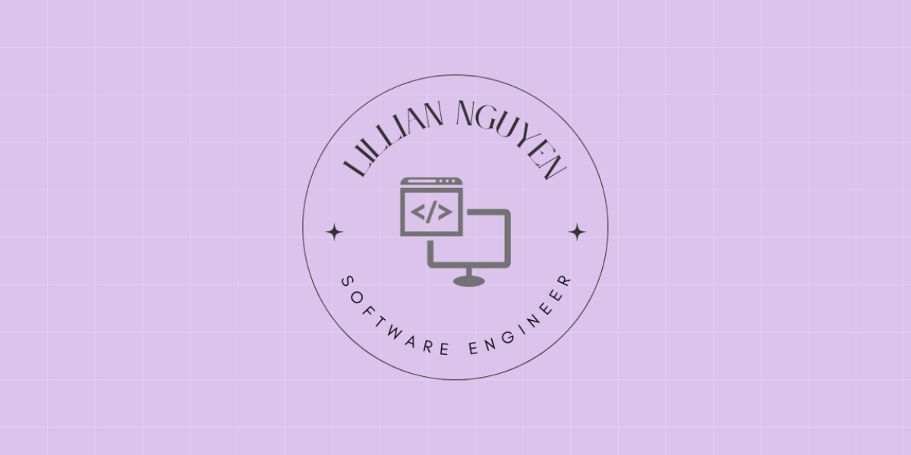

  

 
  
  

<h2 align="center">Projects</h2>
<table bordercolor="#7b31c4">
  
  <tr>
    <td width="50%" valign="top">
      <h3 align="center">Cocktail Database</h3>
         
        
         
        

            
          
      

        
<strong>JavaScript, HTML, CSS, Git</strong> - Web Application with RESTful API Integration. Cocktail Database is the all-in-one tool for cocktail enthusiasts. Dive into the extensive database and discover detailed recipes, ingredient lists, and visuals for each drink. Whether you're searching for a new combination to try or need the perfect recipe for your next gathering, the Cocktail Database has you covered!

    </td>
  </tr>
</table>

<h3 align="center">Languages and Tools:</h3>

 
   
   
   
   
   

<h3 align="center">Connect</h3>

  
    
     

